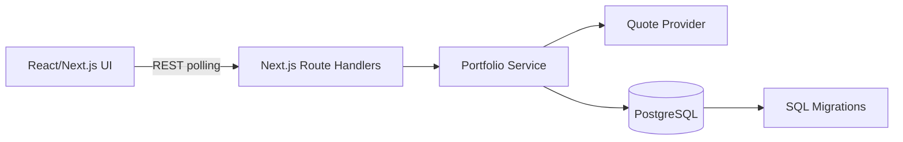
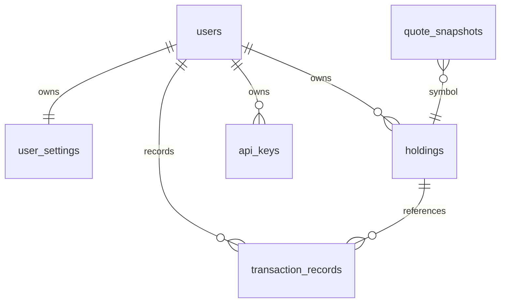

# 個人股票庫存即時網站 Software Design Document

## 1. 系統概述

本系統提供個人投資人管理股票庫存、交易紀錄與即時估值的網站。使用者可以查看持股清單、新增買賣交易、取得報價、計算市值與損益。

範圍包含：

- 持股管理：新增、查詢、更新、刪除。
- 交易紀錄：買進、賣出、手續費與已實現損益。
- 即時報價：前端定時呼叫 `/api/quotes` 與 `/api/holdings`。
- 投資組合儀表板：總市值、成本、損益、報酬率與配置圖。

## 2. 需求

功能需求：

- 顯示股票代號、名稱、數量、平均成本、現價、市值、未實現損益。
- 新增交易後自動更新持股。
- 支援台股與美股格式，例如 `2330.TW`、`AAPL`、`AMZN`。
- REST API 提供 holdings、transactions、quotes。

非功能需求：

- API 回應目標低於 500ms，不含外部行情 provider 延遲。
- 前端支援桌機與手機。
- API key 僅能透過環境變數設定。
- 正式環境需使用 HTTPS/TLS 與資料庫持久化。
- 架構需能替換行情供應商與資料庫存取層。

## 3. 架構設計

正式部署採用 Next.js on Vercel。API route 作為後端入口，資料層可由 demo store 替換為 PostgreSQL。



本 repo 另保留 `backend/server.js` Express 範例，供需要獨立 Node.js API 服務時延伸。

## 4. 資料模型



主要資料表：

| Table | 說明 |
| --- | --- |
| `users` | 使用者帳號與登入識別 |
| `user_settings` | 預設貨幣、時區 |
| `holdings` | 持股庫存，含數量與平均成本 |
| `transaction_records` | 買賣交易紀錄 |
| `quote_snapshots` | 報價快照 |
| `api_keys` | 加密保存的外部 API key |

SQL migration 位於 `db/migrations/001_create_tables.sql`。

## 5. API 介面規格

### `GET /api/holdings`

回傳持股與計算欄位。

```json
{
  "holdings": [
    {
      "symbol": "2330.TW",
      "name": "台積電",
      "quantity": 100,
      "avg_cost": 500,
      "current_price": 600,
      "market_value": 60000,
      "unrealized_pnl": 10000
    }
  ]
}
```

### `POST /api/holdings`

輸入：

```json
{ "symbol": "2330.TW", "name": "台積電", "quantity": 100, "avg_cost": 500 }
```

### `GET /api/transactions`

回傳交易紀錄，正式版可擴充 `symbol`、`from`、`to` 查詢條件。

### `POST /api/transactions`

輸入：

```json
{ "symbol": "AAPL", "type": "buy", "trade_date": "2026-05-10", "price": 150, "quantity": 10, "fee": 1 }
```

### `GET /api/quotes?symbol=2330.TW,AMZN`

回傳：

```json
{
  "quotes": {
    "2330.TW": { "price": 610, "currency": "TWD", "source": "yahoo-finance-chart" },
    "AMZN": { "price": 120.5, "currency": "USD", "source": "yahoo-finance-chart" }
  }
}
```

## 6. 前端設計

技術：Next.js App Router、React client components、CSS modules style through global stylesheet。

Component tree：

```text
app/page.jsx
└─ PortfolioDashboard
   ├─ Header
   ├─ Summary Metrics
   ├─ HoldingsTable
   ├─ PriceChart
   └─ TradeForm
```

UI 草圖：

```text
┌──────────────────────────────────────────────┐
│ Header: 個人股票庫存              更新報價   │
├──────────┬──────────┬──────────┬────────────┤
│ 總市值   │ 總成本   │ 損益     │ ROI        │
├──────────────────────────┬───────────────────┤
│ HoldingsTable            │ PriceChart        │
│                          ├───────────────────┤
│                          │ TradeForm         │
└──────────────────────────┴───────────────────┘
```

## 7. 後端實現

正式執行入口：

- `app/api/holdings/route.js`
- `app/api/holdings/[id]/route.js`
- `app/api/transactions/route.js`
- `app/api/transactions/[id]/route.js`
- `app/api/quotes/route.js`

服務層：

- `lib/store.js`：demo 資料存取與 mutation。
- `lib/calculations.js`：市值、成本、損益與交易套用公式。

外部行情整合：

- 目前使用 Yahoo Finance chart API，免 API key。
- Yahoo Finance 為非官方免費資料源，可能延遲、限流或格式變動；正式商用可再切換 Fugle、Fubon、Finnhub、Polygon 等授權 provider。

## 8. 計算邏輯

- 市值：`quantity * current_price`
- 成本：`quantity * avg_cost`
- 未實現損益：`market_value - cost_basis`
- 未實現損益率：`unrealized_pnl / cost_basis * 100`
- 買進後平均成本：`(原成本總額 + 買進數量 * 買進價格 + 手續費) / 新總數量`
- 賣出已實現損益：`(賣出價格 - 平均成本) * 賣出數量 - 手續費`
- 金額四捨五入至小數第二位。

## 9. 安全性

- 正式環境應導入 JWT 或 OAuth session。
- 所有 mutation API 需驗證使用者身份與資源 ownership。
- API key 僅放在 Vercel Environment Variables 或密鑰管理服務。
- 生產環境透過 Vercel HTTPS/TLS。
- 資料庫連線使用最小權限帳號。

## 10. 測試計畫

測試類型：

- 單元測試：`lib/calculations.js` 持股與損益公式。
- 整合測試：API route 的 CRUD 與錯誤處理。
- E2E 測試：新增交易、刷新報價、表格更新。

建議工具：

- Node test runner 或 Jest。
- Playwright 或 Cypress。
- GitHub Actions 執行 `npm ci` 與 `npm run build`。

## 11. 部署步驟

本專案可由 GitHub 連動 Vercel：

1. Push 到 GitHub repository。
2. 在 Vercel 以 `johnnyaver@gmail.com` 帳號匯入該 repository。
3. Framework 選 Next.js。
4. Build command：`npm run build`。
5. Install command：`npm ci`。
6. 若接正式行情與資料庫，設定環境變數：
   - `DATABASE_URL`
   - `JWT_SECRET`
   - `FUGLE_API_KEY` 或其他 quote provider key

CI 設定位於 `.github/workflows/ci.yml`。Docker build 可使用：

```bash
docker build -t personal-stock-portfolio .
docker run -p 3000:3000 personal-stock-portfolio
```
